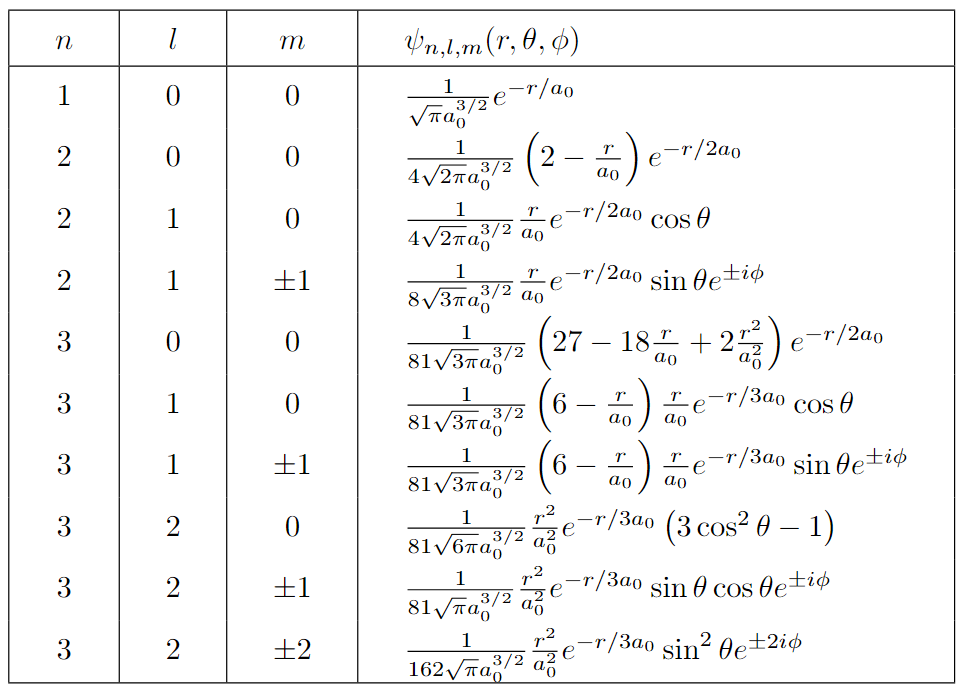
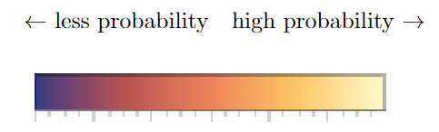
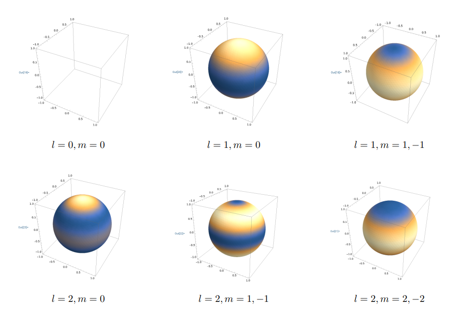
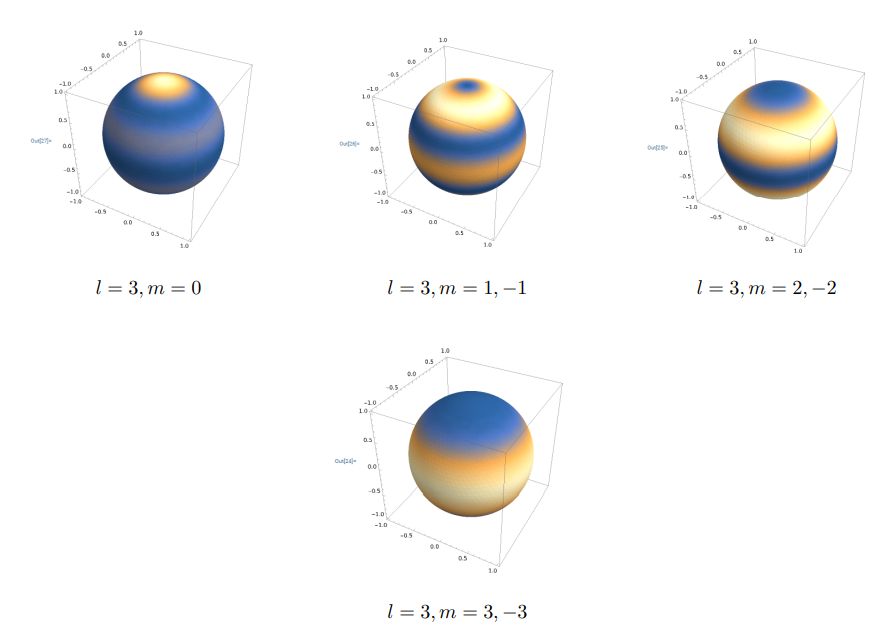
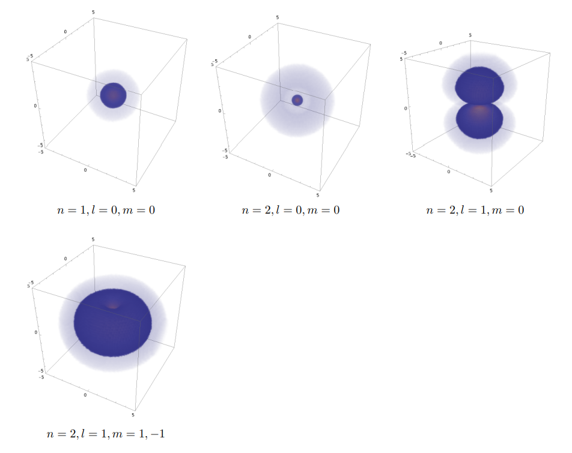
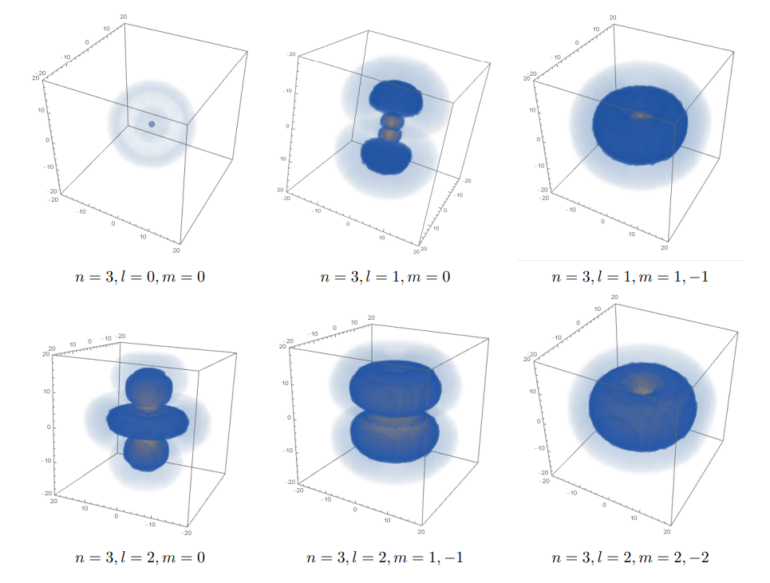

#### 수소원자는 '실제로' 어떻게 생겼을까?
수소원자의 파동함수를 구하고 확률분포를 시각화 해보자. 우리는 수소원자가 어떻게 '생겼냐'를 묻고 있으므로 '위치'에 대한 확률분포를 구하면 된다. 여기서 내가 제목을 그냥 수소원자의 시각화가 아니라 수소원자의 확률분포의 시각화라고 한 이유는 **글쎄 나는 수소원자가 실제로 어떻게 생겼냐고 묻는다면 아직도 잘 모르겠다.**  
우리가 슈뢰딩거 방정식을 풀어내서 일반해를 구했지만 특정한 해를 함수형태로 알고 있는 것은 아니다. 그러니까 일반해를 얻긴 했지만 일반해는 각각 에너지 고유상태들의 선형결합으로 이루어져 있는데 각 고유상태들의 계수가 정해지지는 않았다. 문제를 풀 때에는 문제에서 함수형태를 주어주기도 하지만 과연 실제로는 어떨지는 모르는 것이다. 그래서 보통 수소원자 확률분포의 시각화에서 보여주는 그림은 각각 양자수 n, l, m에 따른 개별 고유상태에서의 파동함수에 대한 것을 보여준다. 그런데 만약 정확한 파동함수의 형태를 우리가 알고 있는 경우나 모르는 경우나 어쨋든 위치는 공간상에 확률적으로 퍼져있기 때문에(여러 가능성이 중첩되어있기 때문에) 이것을 수소원자가 어떻게 '생겼는지' 말해준다고 하기에는 조금 애매해 보인다. 어쨋든 **수소 원자핵을 중심으로 근방에 전자가 하나 존재하긴 할 것이다.**  
이해하기 쉽게 쓴다고 썻는데 내 말이 잘 전달이 되었는지는 모르겠다. 혹시 무슨 말인지 이해가 잘 안된다면 무시해도 될 것 같다. 어쨌거나 지금 보이려고 하는 것은 각 고유상태별로 수소원자의 '위치에 대한 확률분포'라고 명확하게 해두겠다.

#### 확률분포 시각화하는 방법
3차원 공간상에서 확률분포를 표현하고 싶다면 어떻게 해야 할까. 어렵게 생각할 필요 없이 그냥 3차원 좌표에서 임의의 위치마다 그 지점에 확률이 얼마인지를 쓰면 된다.
만약 우리가 1차원 공간(공간 변수가 1개인)에서 파동함수에 대한 확률을 표현하고 싶다면 x축을 공간좌표로 쓰고 y축을 확률값으로 하면된다. 2차원 공간에서 파동함수의 확률을 표현하고 싶다면 x축, y축을 공간좌표로 쓰고 z축을 확률값으로 하면된다. 그런데 3차원 공간에서 파동함수의 확률을 표현하고 싶다면? x축, y축, z축을 공간좌표로 쓰면 더이상 확률을 표현할 차원이 없다. 우리는 3차원 세상까지만 인식할 수 있기때문이다. 그래서 확률값을 새로운 축을 통해 표현하기는 힘들기 때문에 각 지점에 대응하는 확률을 그 지점에 '색깔', '투명도' 따위로 표현하면 된다. 따라서 우리는 3차원 공간상에서 각 지점에 색깔을 통해 값을 할당 할 수 있는 컴퓨터 도구가 필요하다. 

여기서 MATHEMATICA에 대해 잠깐 소개해보고자 한다. MATHEMATICA는 어떤 물리문제를 풀고 시각화하는 등의 영역에서 정말 **강력한** 기능을 제공한다. 이런 수소원자 확률분포의 시각화 같은 작업에서도 MATHEMATICA는 훌륭한 도구이다. 파이썬 같은 다른 범용 언어를 써도 되지만 MATHEMATICA를 쓰면 훨씬 편리하다. 우리는 MATHEMATICA의 ***"3D-Density Plot"*** 함수를 이용할 것이다. 이 함수를 사용하면 우리가 원하는대로 3차원 공간의 각 지점마다 색깔을 통해서 값을 표현할 수 있다.  

[참고문헌 : DensityPlot 설명](https://reference.wolfram.com/language/ref/DensityPlot3D.html)

----
#### 파동함수 표

#### 구면조화함수 확률분포
구면조화함수는 반지름이 아닌 각도와 관련있는 파동함수로 각각의 방위각과 극각에 확률값이 할당되어있다. 이것을 우리는 구 표면을 통해 표현 할 수 있다. 보통 일반적으로 교과서에 적혀있는 구면조화함수 확률분포의 모양은 확률 값을 마치 반지름처럼 보고 그린 것이다. 하지만 이 것은 실제 구면조화함수가 어떻게 생겼는지에 대한 다소 오해의 소지가 있다고 생각한다. 그래서 좀더 명확하게 하기위해 구 표면상에 각 지점마다 확률값을 역시 색깔을 통해 표현하도록 하겠다. 구면조화함수는 방위각과 극각에 따라서만 변하는 함수이므로 구 표면을 통해 표현 가능하다. 여기서는 ***"SliceDensityPlot3D"*** 함수를 이용할 것이다. 

여기서 l=0, m=0 인 구면조화함수가 안보이는 이유는 각에 따른 모든 지점에서 확률이 동일하기 때문에 출력이 되지 않았다.

#### 수소원자 파동함수 확률분포
***"DensityPlot3D"*** 함수를 이용해 수소원자 파동함수의 확률분포를 시각화 해보겠다.  

#### 코드
코드를 올리려 했으나.. 코드가 Wolfram Cloud에 저장이 되어있는데 요금제 구매를 안해서 지금 Wolfram Cloud에 접근을 할 수가 없어서 못 올리게 됐습니다. 다음에 가능하면 올리겠습니다.  
어렵지 않으니 한번 직접 해보세요.. 구면조화함수(연관르장드르), 반지름함수(연관라게르) 다 MATHEMATICA에 내장되있는 함수이고 위의 "DensityPLot3D"함수 쓰면됩니다. 
