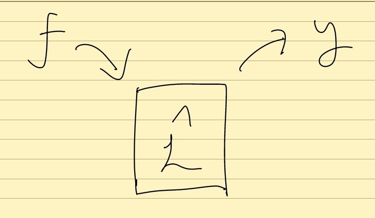

## tex 파일을 markdown 파일로 변환하는 과정에서 글자가 깨졌습니다 대신 pdf 문서를 참고하세요
[그린함수 PDF 문서 보기](./assets/pdf/Green_function.pdf)

## 들어가는 말

내가 그린함수를 처음 접한 것은 학부 전자기학 수업 때 이다. 그 당시 교수님은 그린함수 설명을 시작하는 말로 허구언날 "This is my vending machine"을 말했다. 하지만 내 생각엔 그 당시에 나를 포함해 그 누구도 이 설명을 온전히 이해하지 못했다(이 것이 학생들 잘못은 분명 아니었다). 어찌간에 나중엔 따로 그린함수를 공부해서 의미를 이해하게 되었다. 그린함수 내용자체가 재밌게 다가왔고 그린함수를 이용해 시스템을 분석하고 인과율과 같은 개념까지 연결되는 것이 호기심을 자극했다. 그래서 그린함수를 끝까지 파고 들었다. 이 자료는 그 과정을 집대성한 결과물이다. 내가 봤던 어떤 자료보다도 명쾌하고 쉽게 이해할 수 있는 자료라 스스로 생각한다. 그린함수의 크게 중요하지 않은 개념은 빼고 핵심적이고 '본질적인' 개념에 대해 아주 쉽고 명확히 기술하고 있다. 

## 그린함수 이해하기

### 시스템 모델링 하기

시스템이란 입력을 주면 출력을 내놓는 어떤 함수이다.   
**예시**  

(입력과 출력은 정하기 나름이다)  

어떤 물리적인 현상을 시스템으로 바라 볼 수 있다. 그리고 이런 물리적인 시스템을 수학적으로 모델링 할 수 있다. 그 것은 곧 운동방정식(Equation of motion)이다. 시스템을 '모델링'하고 운동방정식을 '세우는 것'은 **물리학자**들이 아주 잘하는 것이다.
물리적인 시스템의 운동방정식은 보통 시간 또는 공간에 대한 비제차 미분방정식의 형태로 나타나게 된다.
위의 예시(외력이 있는 조화진동자 시스템)를 수학적으로 모델링 하면 다음과 같은 2계 비제차 상미분방정식이 나온다. 입력에 해당 하는 것이 우변의 비제차 항에 해당하는 $f(t)$이고 출력에 해당하는 것이 우리가 구하고자 하는 위치함수 $x(t)$이다.

$$
    \left(\frac{\partial^2{\partial t^2**+2\gamma\partial{\partial t}+\omega_0^2\right)x(t)=f(t)
$$

자 이제 시스템에 입력값을 집어 넣고 시스템을 거쳐서 출력값이 어떻게 나오는지 보고자 한다. 

선형연산자 $L$이 있다고 해보자. 여기서 연산자는 곧 시스템을 의미한다. 어떤 연산자인지에 따라 어떤 시스템인지가 결정된다. $f$라는 입력이 가해진다. 그럼 시스템 $L$을 거쳐 출력 $y$가 나온다. 식으로 나타내면 다음과 같다.  
$$
    Ly=f
$$
여기서 $f$는 입력을 의미하고 $y$는 출력을 의미한다. 헷갈릴 수 있는데 $y$가 입력이 아니고 $f$를 입력이라고 해석한다. 각기 다른 $f$를 입력할 수 있고$f$가 주어지면 시스템$L$을 거쳐서 우리가 구하고자 하는 해인 출력 $y$를 구할 수 있다.

그런데 복잡한 시스템의 결과를 예측하는 것은 쉽지 않다. 또 어떤 시스템은 시스템의 내부가 가려져 있다. 이를 **블랙박스(Black box)화** 되었다고 한다. 기능주의적인 관점에서 볼 때, 시스템의 내부를 모르고 오직 입력과 출력에 대해서만 신경 쓸 때 원하는 결과가 나온다면 시스템은 잘 작동하는 것이다(중국어방 논증처럼).

그리고 시스템은 이렇게 블랙박스화 해서 입력과 출력에만 신경쓰는 것이 더 편하기도하다. 컴퓨터 프로그래머들이 MOSFET이니 OP-amp인지 뭔지 그런거 몰라도 프로그램을 짤 수 있는 것과 같은 맥락이다. 소프트웨어 개발자에게 하드웨어는 가려져 있다. 복잡한 전자회로를 몰라도 오직 입력과 출력에 대해서만 신경쓰면 된다.  

그러면 시스템의 내부를 블랙박스화 했는데 입력에 대해서 출력이 나오는지 도대체 어떻게 어떻게 예측할까? 하지만 시스템의 선형성을 이용해 쉽게 풀 수 있는 방법이 있다. 구체적으로 이를 알아보겠다.  

### 시스템의 선형성을 이용하는 방법

**선형성의 의미 : 시스템(또는 어떤 연산, 함수) L에 대해 $L(c_1\alpha+c_2\beta)=c_1L(\alpha)+c_2L(\beta)$ 가 성립하면 선형성을 가지고 있다고 한다. 1. 스칼라 상수배가 밖으로 나오는 것과 2. 합해서 계산한 것은 각각 계산 후 합한 것과 같다.**
$$
    Ly=f
$$

**시스템이 매우 복잡할 때도있고 입력$f$가 매우 복잡한 함수 일 수도 있다. 이럴 땐 시스템의 선형성을 이용해 쉽게 푸는 방법이 존재한다.**  

먼저 입력함수를 다른 함수들로 분해해서 표현해보자. 테일러 급수, 푸리에 급수 등을 배웠겠지만 어떤 복잡한 함수를 좀 더 쉬운 다른 함수들로 분해하는 것은 많이 쓰는 테크닉이다.  
$$
    f=c_1u_1+c_2u_2+...+c_nu_n
$$
위와 같이 표현할 수 있다. $u_n$이라는 함수를 기저로 사용해 분해하여 표현했다.  
그리고 각각의 기저함수를 입력으로 시스템에 적용했을때 출력을 다음과 같이 표현하기로 하자.
$$
    L(y_1)=u_1  
    L(y_2)=u_2  
    L(y_3)=u_3  
    \ldots  
    L(y_n)=u_n  
$$
분해해서 표현한 $f$를 이용해 다시 써보면 다음과 같다.
$$
    Ly=f=c_1u_1+c_2u_2+...+c_nu_n
$$
이때 이 시스템은 선형 시스템이므로 다음이 성립한다.  
$$
c_1u_1+c_2u_2+...+c_nu_n=c_1L(y_1)+c_2L(y_2)+\ldots+c_nL(y_n)=&L(c_1y_1+c_2y_2+\ldots+c_ny_n)  
=&L(y)
$$
따라서 $y=c_1y_1+c_2y_2+\ldots+c_ny_n$이 된다.  

정리하면 입력 $f=c_1u_1+c_2u_2+...+c_nu_n$에 대해 출력은 $y=c_1y_1+c_2y_2+\ldots+c_ny_n$이다.  

**정리해보면, 우리는 $f$를 입력했을때 시스템$L**$을 거쳐서 출력 $y$가 무엇인지 알고싶다. 근데 $f$가 복잡하다면 입력함수 $f$를 어떤 기저를 이용해 분해하여 표현한다. 그 임의의 기저를 $u_n$이라고 하자. 시스템의 선형성을 이용하면 출력함수를  $y=c_1y_1+c_2y_2+\ldots+c_ny_n$으로 구할 수 있다. 그니까 $y_n$을 알면 출력함수를 알 수 있다. $y_n$은 어떻게 구했더라? $ \hat{Ly_n=u_n$이렇게 구한다. 임의의 기저 $u_n$에 대하여 한 번만 계산해주면 된다.
}
처음부터 복잡한 $f$에 대하여 계산하는 것이 아니라 $f$를 다른 기저를 이용해 분해하여 표현한 다음에 $f$가 아니라 그 기저에 대해서 출력을 계산해주는 것이다. 이 것만 알아도 시스템의 선형성을 이용해 전체 출력을 알 수 있다.  

입력함수($f$)를 위와 같이 다른 기저함수($u_n$)들로 분해하여 선형결합의 형태로 쓸 수 있다면 출력함수($y$)는 각각의 기저함수들에 대한 출력값($y_n$)의 선형결합이다. 우리는 이제 입력 $f$를 어떠한 형태로 분해하여 쓸지 알아보겠다.  
미분가능한 함수라면 테일러 급수를 통해 다항함수로 분해해도 될테고 주기함수라면 푸리에급수를 통해 삼각함수로 분해해도 될테다. 하지만 우리는 델타함수를 이용해 분해할 것이다!   

### 델타함수를 이용한 임의의 함수 표현

델타함수를 알아보자. 어떤 직사각형이 있다. 이 직사각형의 넓이는 항상 1이다. 이 직사각형의 밑변 줄여보자. 넓이가 1이 되어야 하므로 높이가 커진다. 계속해서 밑변을 줄여보자. 그럼 높이는 계속 커진다. 이렇게 계속해서 극한을 취하면 결국 밑변은 0이고 높이는 무한이며 넓이는 1인 직사각형이 된다. 이 것이 델타함수이다. 델타함수는 특정 지점에대해서 밑변이 0 높이가 무한한 직사각형인 함수라고 할 수 있다. 넓이는 곧 적분을 의미하므로 델타함수를 직사각형을 포함하는 구간에 대해 적분하면 1이 된다. 그래서 델타함수를 적분하면 1이된다.

그래서 임의의 함수는 델타함수로 대체 어떻게 표현이 될까? 
임의의 함수는 다음과 같이 직사각형들의 합으로 근사될 수 있다. 직사각형의 폭을 무한히 좁게 한다면 정확히 $f(x)$가 나올 것이다. 이 직사각형은 델타함수를 나타낸다. 여기서의 델타함수는 아직 극한이 취해지지 않은 밑변과 높이가 유한한 직사각형이다. 

이것을 수식으로 적어보면 다음과 같다.
$$
    &f(x)\approx f_1\times\delta_{\square}(x-1*\Delta x)+f_2\times\delta_{\square}(x-2*\Delta x)+f_3\times\delta_{\square}(x-3*\Delta x)+\ldots+f_n\times\delta_{\square}(x-n*\Delta x)  
    &=\Sigma_n f_n*\delta_{\square}(x-n*\Delta x)
$$
여기서 $f_n=f(n*\Delta x)$.

이제 $\Delta x \rightarrow 0$으로 가는 극한을 취해보면 다음과 같이 쓸 수 있다.  
$n\Delta x \rightarrow x'\,,\,f_n\rightarrow f(x')\,,\, \lim_{\Delta x\rightarrow0}\Sigma_n \rightarrow \int dx'$  
가로 폭이 유한했던 직사각형 형태의 델타함수$\delta_{\square}(x-n*\Delta x)$는 이제 가로 폭이 $0$이고 세로가 무한대인 진짜 델타함수$\delta(x-x')$가 되었다. 따라서 최종적으로 다음과 같이 쓸 수 있다.
$$
    f(x)=\int f(x')\delta(x-x')dx'
$$
연속적인 변수 $x'$를 조금씩 변화시키며 $f(x')$를 더해준다. 이 표현을 우리는 $f(x)$를 델타함수를 기저로 분해하였다고 해석할 수 있다. $\delta(x-x')$이 기저, $f(x')$이 계수를 의미한다.   

### 그린함수 공식

입력 $f$를 델타함수를 기저로 분해하는 방법에 대해 알아보았다. 거의 다왔다. 위에서 설명한 내용을 다시 요약하자면,  
1. $f=c_1u_1+\ldots +c_nu_n$과 같이 복잡한 함수를 분해하여 쓴다.  
2. 시스템의 선형성을 이용하면 $y=c_1y_1+c_2y_2+\ldots+c_ny_n$ 같이 각각의 합으로 구할 수 있다.  
3. 여기서 $y_n$ 은 입력함수의 기저에 대한(전체 입력함수가 아닌) 출력이다. $L(y_n)=u_n$으로 구한다.  
복잡한 함수$f$ 와 복잡한 시스템(연산자)$L$을 가지고 $Ly=f$를 직접 다 풀 필요가 없이,\, $L(y_n)=u_n$으로 구한 $y_n$을 이용해 $y$를 구할 수 있다.  

그런데 우리는 기저함수로 델타함수를 사용해 $f(x)$를 표현하기로 하였다. 우리는 극한을 취했고 $f(x)$는 연속적인 변수$x'$을 통해 표현된다.  
그렇기 때문에 $f=c_1u_1+\ldots +c_nu_n=\Sigma_n c_nu_n$와 같이 되지 않고 $f(x)=\int f(x')\delta(x-x')dx'$ 처럼 합이 아닌 적분형태로 표현되었다.
위에서 논의한 것과 비교하며 그린함수 공식을 유도해보자.
\line(1,0){500}

시스템이 있다.
$$
    Ly(x)=f(x)
$$
입력함수$f$는 다음과 같이 분해된다.
$$
    f(x)=\int f(x')\delta(x-x')dx'
$$
델타함수를 통해 위처럼 표현된다. 이때,
$$
    LG(x-x')=\delta(x-x')
$$
기저함수인 델타함수 입력에 대한 시스템의 응답을 $G(x-x')$이라고 표현한다.  
**$G(x-x')$을 그린함수라고 부른다.**
이제 이 것을 첫번째 식에 대입해주면,
$$
    f(x)=\int f(x')\delta(x-x')dx'=\int f(x')LG(x-x')dx'
$$
여기서 시스템의 선형성을 이용하면 연산자 $L$이 적분식 밖으로 빠져나와 전체에 적용이 된다.  
(선형성에 의해, 각각을 연산자 작용후에 적분한 것은  적분을 해준후 연산자를 작용 시키는 것과 같기 때문에)
$$
   \int f(x')LG(x-x')dx'=L\int f(x')G(x-x')dx'=Ly(x)
$$
따라서 위 마지막 두 항을 비교하면,
$$
    y(x)=\int G(x-x')f(x')dx'
$$
$y(x)$는 합이 아니라 연속적인 변수$x'$을 이용해 적분식으로 표현되었다.  
\hfill
\vrule width 1pt
\hfill
시스템이 있다.
$$
    Ly=f
$$
입력함수$f$는 다음과 같이 분해된다.
$$
    f=c_1u_1+c_2u_2+...+c_nu_n
$$
임의의 기저함수를 이용해 분해했다. 이때,
$$
    L(y_n)=u_n
$$
기저함수인 임의의 $u_n$ 입력에 대한 시스템의 응답을 $y_n$이라고 표현한다.   
이제 이 것을 첫번째 식에 대입해주면,
$$
f=\Sigma_nc_nu_n=\Sigma_nc_nL(y_n)
$$
여기서 이 시스템은 선형 시스템이므로 다음이 성립한다.  
(각각 연산후 더한 것과 다 더한후 연산한 것이 같기 때문에)
$$
\Sigma_nc_nL(y_n)=L\left(\Sigma_nc_n(y_n)\right)
$$
혹은 풀어쓰면,
$$
    c_1L(y_1)+c_2L(y_2)+\ldots+c_nL(y_n)  
    =L(c_1y_1+c_2y_2+\ldots+c_ny_n)=Ly
$$
따라서 위 마지막 두 항을 비교하면,  
$y=c_1y_1+c_2y_2+\ldots+c_ny_n$이 된다.  
\line(1,0){500}

정리하면,  
그린함수는 다음과 같이 정의된다.
$$
    LG=\delta
$$
이때 시스템의 출력값은 다음과 같이 주어진다.
$$
    y(x)=\int G(x-x')f(x')dx'
$$
델타함수를 입력 시켰을 때 시스템의 출력 $G(x-x')$, 즉 그린함수에 $f(x')$을 곱한후 적분하면된다. 그런데 혹시 이러한 적분 식이 익숙한 사람도 있을 것이다. 이 연산에는 이름이 붙어있다. 바로** 합성곱(convolution)**이다! 따라서 간단하게 다음과 같이 쓰자.
$$
    y(x)=G(x)*f(x)
$$
시간영역의 합성곱은 주파수 영역의 단순 곱이다. 따라서 푸리에 변환을 하면 다음과 같이 쓸 수 있다. 
$$
    Y(w)=H(w)F(w)
$$
그린함수의 푸리에 변환 $H(w)$를 전달함수(Transfer function)이라고 부른다.  

그러면 그린함수는 어떻게 구하지?  
$LG(x-x')=\delta(x-x')$을 통해서 구하면 된다. 이 식을 만족하는 $G(x-x')$을 찾는다.

### 그린함수의 의미

델타함수를 입력으로 넣는 다는 것의 의미는 무엇일까?  

시스템을 자판기에 비유했다. 우리는 가장 쉬운 입력을 넣어보려고 한다. 자판기에 100원을 넣는 것이다. 그리고선 100원을 넣었을 때 출력으로 음료수가 몇개나오는지 살펴보면 된다. 자판기는 선형시스템이므로, 만약 우리가 100원을 넣었을 때 음료수 1개가 나온다는 것을 알 수 있다면 200원은 2개, 300원 3개 ... 1200원은 12개.. 등 음료수가 몇개 나오는지를 예측할 수 있다. 임의의 입력은 100원의 선형결합으로 분해 될 수 있다. 예를 들면 700원 = 100+100+100+100+100+100+100 원이다. 그래서 가장 기본이 되는 기저인 100원에 대한 출력을 구해보자는 것이다.

그래서 결국 우리는 100원을 넣었을 때 나오는 음료수의 개수만 알면 된다. 매번 입력에 대하여 그 입력값을 복잡한 시스템에 적용시키고 계산하여 출력을 구할 필요가 없다는 것이다. 기본단위라고 할 수 있는 100원에 대한 출력값을 한번 구해놓으면 끝이다. 나머지는 시스템의 선형성을 이용하여 계산 할 수가 있는 것이다. 이 100원이라는 입력에 대한 출력값이 바로 그린함수이다.  
이렇게 시스템을 모델링하고 그린함수를 찾고 하는 것은 공학분야에 정말 다양하게 응용될 수 있으며 신호처리, 제어이론 등의 기초 토대가 된다.  

\parbox{12cm{
        그린함수 = "기본 단위 입력에 대한 시스템의 출력" ,\,\,또는  
        그린함수 = "단위 임펄스(델타함수)에 대한 시스템의 응답(해)"
    }
}  

## 그린함수의 풀이와 적용

그린함수를 이용해 미분방정식을 푸는 방법을 알아보았다. 실제 몇가지 미분방정식 문제를 살펴보며 각 시스템의 그린함수를 찾고 방정식의 해를 구해보자. 그린 함수를 구하는 방법에는 여러 가지가 있다. 어쩌나 저쩌나 무슨 방법이든지 그린 함수만 찾으면 그만이다. 몇몇 미분 방정식에서는 그린함수를 찾는 창의적인 방법을 쓸 수도 있다(아래에서 직접 살펴 볼 것이다). 하지만 어떤 시스템이든지 그린함수를 찾는 어느정도 기초적인 방법론이 있다. 이 것을 살펴보고 여러 시스템에서 그린함수를 직접 계산해보자.  
만약 그린함수를 구하는 것이 매우 어렵다면 굳이 그린함수를 이용하지 않아도 된다. 미분방정식의 해를 쉽게 찾기 위해 그린함수를 쓰는데 이 걸 구하는게 매우 어려워진다면 배보다 배꼽이 더 커지는 셈이다. 하지만 대부분의 경우에 그린함수를 이용해 해를 구하는 것이 복잡한 입력에 대한 비제차 미분방정식을 직접 구하는 것보다는 쉽다. 또한 그린함수를 한번 구해놓으면 어떤 입력값에 대해서도 적분만 해주면 해를 구할 수 있기 때문에 매우 편리하다. 그린함수는 단위 임펄스에 대한 응답이므로 어떤 시스템의 특성을 파악할 수 있기도 하다.   

(이 버전은 풀이과정에 미완인 부분이 있는 버전입니다)

### 그린함수 기본 풀이법의 인사이트

그린함수를 찾기위해 공통적으로 쓰일 수 있는 기본적인 방법에 대해서 먼저 알아볼 것이다. 이 것을 정리하고 가는 것이 그린함수의 풀이를 이해하는데에 인사이트를 줄 것이라 기대됨으로 정확히 정리하고 넘어가고자 한다. 어차피 각각 세세한 계산은 문제를 풀면서 다 할 것이므로 시간이 없다면 이 부분은 건너뛰어도 좋다(하지만 그렇지 않기를 추천한다).  

#### 푸리에 변환(또는 라플라스 변환)을 이용한 미분방정식 풀이

먼저 푸리에 변환에 대해 언급하고 싶다. 푸리에 변환만 가지고도 많은 얘기들을 할 수 있지만 여기서는 푸리에 변환을 이용해 미분방정식을 풀이하는 방법에 대해 얘기할 것이다. 푸리에 변환은 임의의 함수(주기, 비주기 함수 모두)를 $e^{iwt}$라는 가장 기본적인 주기함수를 이용해 **분해**하여 각각의 $w$ 에 대한 $e^{iwt}$가 얼마만큼 기여하는 지를 표현한 식이다. 푸리에 변환한 결과는 $w$에 대한 함수이다. 이는 $w$의 주파수를 가지는 $e^{iwt}$ 라는 가장 기본적인 주기신호 기저에 대해서, $w$가 연속적으로 변함에 따라 그에 대응하는 각 기저함수$e^{iwt}$ 가 기존의 신호에 얼마만큼의 기여하는지를 나타낸식이다. 시간에 대한 함수를 주파수 스펙트럼으로 본 것이라 할 수 있다. 시간에 대한 함수를 주파수에 대한 함수로 볼 수 있다는 것이 가장 중요한 포인트이다. 더 자세한 설명은 생략하겠다.    
  푸리에 변환을 이용하면 미분 방정식을 대수 방정식으로 바꾸어 풀이할 수 있다. 기본 컨셉은 다음과 같다.  
1. 푸리에 변환(또는 라플라스 변환)을 한다 $\rightarrow$ 2. 대수방정식으로 바뀐다 $\rightarrow$ 3. 대수방정식을 푼다 $\rightarrow$  4. 푸리에 역변환을 한다  

핵심은 미분방정식을 대수방정식으로 바꾼다는 것이다. 대수방정식의 풀이법은 우리가 잘 알고 있는 것이 많으므로 계산이 훨씬 쉽다. 끽해야 2차방정식 정도만 풀면 된다.   

#### 예제 문제

미분 방정식 $y''+y=e^{3t}\,,\,(y(0)=y'(0)=0)$ 을 풀어라.

$$
    &y(t)=1{2\pi i}\int_{\gamma-i\infty}^{\gamma+i\infty} y(s)e^{st}ds  
    \rightarrow &\partial^2{\partial t^2}\left(1{2\pi i}\int_{\gamma-i\infty}^{\gamma+i\infty} y(s)e^{st}ds\right)+1{2\pi i}\int_{\gamma-i\infty}^{\gamma+i\infty} y(s)e^{st}ds=1{2\pi i}\int_{\gamma-i\infty}^{\gamma+i\infty} 1{s-3}e^{st}ds
$$
첫항의 미분을 수행한 후 정리하면 다음과 같다.  
$$
    1{2\pi i}\int_{\gamma-i\infty}^{\gamma+i\infty}\left( s^2+1\right)y(s)e^{st}ds=1{2\pi i}\int_{\gamma-i\infty}^{\gamma+i\infty}\left(1{s-3}\right)e^{st}ds
$$
위 식을 만족하기 위해선,
$$
    (s^2+1)y(s)=1{s-3}
$$
이 되어야 한다. 라플라스 변환을 통해 미분방정식을 대수방정식으로 바꾸었다. 이 대수방정식은 양변을 $(s^2+1)$을 나누어 줌으로써 간단히 구할 수 있다.  
$$
    y(s)=1{(s^2+1)(s-3)}=1{(s+i)(s-i)(s-3)}
$$
$s$영역의 함수를 구했으므로 이제 라플라스 역변환을 해주어 본래 함수를 구해보자.  
$$
    y(t)=1{2\pi i}\int_{\gamma-i\infty}^{\gamma+i\infty} y(s)e^{st}ds=1{2\pi i}\int_{\gamma-i\infty}^{\gamma+i\infty} 1{(s+i)(s-i)(s-3)}e^{st}ds
$$
유수정리(Residue theorem)을 이용해 풀겠다.  

  %---- 파라미터 ----
  \def4    % gamma (수직선의 실수값)
  \def5    % 반원 반지름

  %---- 좌표축 ----
  \draw[->,thick] (-\R-0.5,0) -- (\g+0.7,0) node[right] {$Res$};
  \draw[->,thick] (0,-\R-0.5) -- (0,\R+0.7) node[above] {$Ims$};

  %---- Bromwich 수직선 ----
  \draw[dashed] (\g,-\R) -- (\g,\R) node[above] {$\Re s=\gamma$};

  Latex}}]
        (\g,-\R) -- (\g,\R);

  %---- 좌측 반원호 ----
  Latex}}]
        (\g,\R) arc (90:270:{\R});

  %---- 극점 ----
  \fill (0, 1) circle (2pt) node[right] {$\;i$};
  \fill (0,-1) circle (2pt) node[right] {$\;-i$};
  \fill (3, 0) circle (2pt) node[below right] {$\;3$};

  %---- 라벨 ----
  \node at ({(\g-\R)/2},\R+0.3) {$C_R$};   % 큰 반원

$$
    Res(-i)=e^{-it}{2i(i+3)}\,,\,Res(i)=e^{it}{2i(i-3)}\,,\,Res(3)=e^{3t}{(3+i)(3-i)}
$$
$$
    y(t)=1{2\pi i}\cdot 2\pi i \left(Res(-i)+Res(i)+Res(3)\right)=e^{-it}{2i(i+3)}+e^{it}{2i(i-3)}+e^{3t}{(3+i)(3-i)}  
    =-3{10}t-1{10}t+1{10}e^{3t}
$$
다른 방법으로 풀어도 같은 결과를 주는 것을 확인할 수 있을 것이다.  

    \parbox{13cm{
       다시 이 풀이법을 요약해보면, 다음과 같다.  
1. 미분방정식이 있다.  
2. 라플라스변환을 통해 s 영역에서 미분방정식을 살펴본다. $y(t)\rightarrow y(s)$  
3. 그럼 간단한 대수방정식이 되고 이를 풀어서 $y(s)$를 구한다.  
4. 라플라스 역변환을 통해 $y(t)$를 구한다.  
5. 라플라스 변환의 적분식에서 일반적으로 칸토어 적분을 이용하여 계산한다.  
    }
}  

이 흐름을 이해한채 그린함수 풀이법을 본 다면 이해가 쉬울 것이다.  
공대에서 공업수학시간에 라플라스 변환을 이용한 미분방정식 풀이를 배울때는 수학과나 물리학과처럼 일일히 라플라스 변환을 해주는 적분계산을 하지 않는다. 그러므로 복잡한 칸토어 적분을 할 필요도 없다. 그냥 라플라스 변환표에 있는 결과를 가져다 쓰는 것이 정석이다. 하지만 역시 공대는 맘에들지 않는다.  
이제 본격적으로 여러 문제를 살펴보면서 각 시스템의 그린함수를 구해보자.

### 외력이 있는 조화진동자

외력이 작용하고 마찰이 있는 조화 진동자가 있다고 하자. 그 시스템은 다음과 같이 적을 수 있다.
$$
    \left(\partial^2{\partial t^2}+2\gamma\partial{\partial t}+\omega_0^2\right)x(t)=f(t)
$$
이 방정식의 해($x(t)$)를 구하는 여러가지 방법이 있다. 제차해와 특수해를 구하고 더해서 일반해를 구하는 기본적인 방법이 있겠고, $f(t)$가 주어져 있다면 라플라스 변환을 이용해 푸는 방법도 있고, 그린함수를 이용해 푸는 방법이 있다. 우리는 그린함수를 이용해 풀겠다. 그린함수를 이용해 푸는 것은 라플라스 변환을 이용해 푸는 것과  유사한 느낌이 있다. 그 것이 내가 그린함수 풀이법의 인사이트로 라플라스변환을 언급한 이유이다.  

그린함수의 정의에 따라 다음을 만족하는 그린함수$G(t,t')$를 찾자. 
$$
    \left(\partial^2{\partial t^2}+2\gamma\partial{\partial t}+\omega_0^2\right)G(t,t')=\delta(t-t')
$$
역시 어쩌나 저쩌나 무슨 방법이 됐던 위 조건을 만족하는 그린함수만 찾으면 장땡이다. 그런데 막막하다. 도대체 어떤 함수를 넣어야 우변이 델타함수가 나올까. 방정식을 그대로 보면 어려우니, 우리는 이 문제를 어떤 변환을 통해서 대수방정식으로 바꾸어 보고 싶다(라플라스변환을 이용해 미분방정식을 풀었던 철학과 동일하게). 푸리에 변환을 해서 주파수 영역에서 방정식을 살펴보면 우변의 델타함수는 그냥 1이 되어 아주 간단해진다.  

위 미분방정식을 대수방정식으로 바꾸기 위해 푸리에 변환을 사용하겠다(라플라스 변환대신).
$$
    G(t,t')= 1{2\pi}\int G(w)e^{iw(t-t')}dw
$$
위 미분방정식에 대입해보면,  
$$
    &\partial^2{\partial t^2}\left(1{2\pi}\int G(w)e^{iw(t-t')}dw\right)+2\gamma\partial{\partial t}\left(1{2\pi}\int G(w)e^{iw(t-t')}dw\right)+\omega_0^2\left(1{2\pi}\int G(w)e^{iw(t-t')}dw\right)  
    &=\delta(t-t')=1{2\pi}\int e^{iw(t-t')}dw
$$
미분을 수행한 후 정리하면 다음과 같다. 
$$
    1{2\pi}\int_{\gamma-i\infty}^{\gamma+i\infty} \left( -w^2+2\gamma iw+\omega_0^2\right)G(w)e^{iw(t-t')}dw=1{2\pi}\int e^{iw(t-t')}dw
$$
이 식을 만족하기 위해선,
$$
    (-w^2+2\gamma iw+\omega_0^2)G(w)=1
$$
이 되어야 한다. 푸리에 변환을 통해 시간영역이 아닌 주파수영역에서 살펴봄으로써 미분방정식이 대수방정식이 되었다.  
이 대수방정식은 양변을 $(-w^2+2\gamma iw+\omega_0^2)$로 나눠줌으로써 간단히 구할 수 있다.  

$$
    G(w)=-1{(w^2-2\gamma iw-\omega_0^2)}\,.
$$
인수분해하면 다음과 같이 쓸 수 있다.
$$
    G(w)=-1{\left(w-(i\gamma+\omega_0^2-\gamma^2\,)\right)\left(w-(i\gamma-\omega_0^2-\gamma^2\,)\right)}
$$
주파수 영역의 그린함수를 구했으므로 이제 푸리에 역변환을 해주어 본래 그린함수를 구해보자.  
$$
    &G(t,t')= 1{2\pi}\int G(w)e^{iw(t-t')}dw  
    &=-1{2\pi}\inte^{iw(t-t')}{\left(w-(i\gamma+\omega_0^2-\gamma^2\,)\right)\left(w-(i\gamma-\omega_0^2-\gamma^2\,)\right)}dw
$$
이 적분을 계산하기 위해선 복소평면에서 칸토어 적분을 해야한다. 유수정리(Residue theorem)를 이용하여 계산해보자.
t와 t'의 대소에 따라 적분 경로를 다르게 잡아주어야 하므로 두 가지 경우로 나누어 계산해야 한다. 이 것은 Jordan 따름정리와 관련이 있다.

- $t<t'$ 인 경우

적분이 발산하지 않기 위해선 아래쪽 반원으로 적분경로를 잡는다.
아래쪽 반원 안에는 특이점이 없기 때문에 적분 값은 0이다.

- $t>t'$ 인 경우

적분이 발산하지 않기 위해선 위쪽 반원으로 적분경로를 잡는다.

  % ---------- 파라미터 ----------
  \def4.5                     % 반원 반지름
  \def1.2                 % 감쇠 계수 (Im 부분)
  \def2.5                    % sqrt(ω0^2-γ^2)  (Re 부분)

  % ---------- 좌표축 ----------
  \draw[->,thick] (-\R-0.6,0) -- (\R+0.6,0) node[right] {$Rew$};
  \draw[->,thick] (0,-0.2) -- (0,\R+0.6) node[above] {$Imw$};

  % ---------- 실제 적분 구간 (실축) ----------
  \draw[thick,
        postaction={decorate},
        decoration={markings,
          mark=at position 0.5 with {Latex}}]
        (-\R,0) -- (\R,0) node[below right=-2pt] {};

  % ---------- 상반평면 반원 ----------
  \draw[thick,
        postaction={decorate},
        decoration={markings,
          mark=at position 0.5 with {Latex}}]
        (\R,0) arc (0:180:\R);
  \node at (0.6,\R+0.3) {$(t>t')$};
    % ---------- 하반평면 반원 ----------
 

  % ---------- 극점 ----------
  \fill (\om,\gammas) circle (2pt) node[right] {$w_{+}=i\gamma+\omega^2-\gamma^2$};
  \fill (-\om,\gammas) circle (2pt) node[left] {$w_{-}=i\gamma-\omega^2-\gamma^2$};

$$
    G(t,t')=-1{2\pi}\cdot 2\pi i \left[ Res\left(i\gamma+\omega_0^2-\gamma^2\right)+ Res\left(i\gamma-\omega_0^2-\gamma^2\right)\right]
$$
$$
Res\left(i\gamma+\omega_0^2-\gamma^2\right)=e^{i\left(i\gamma+\sqrt{\omega_0^2-\gamma^2\right)(t-t')}}{2\omega_0^2-\gamma^2}\,,\,  
Res\left(i\gamma-\omega_0^2-\gamma^2\right)=-e^{i\left(i\gamma-\sqrt{\omega_0^2-\gamma^2\right)(t-t')}}{2\omega_0^2-\gamma^2}\,.
$$

$$
    G(t,t')=-i{2\omega_0^2-\gamma^2}\left(e^{i\left(i\gamma+\omega_0^2-\gamma^2\right)(t-t')}-e^{i\left(i\gamma-\omega_0^2-\gamma^2\right)(t-t')}\right)  
    =-ie^{-\gamma (t-t')}{2\omega_0^2-\gamma^2}\left(e^{i\left(\omega_0^2-\gamma^2\right)(t-t')}-e^{-i\left(\omega_0^2-\gamma^2\right)(t-t')}\right)
    =e^{-\gamma (t-t')}{\omega_0^2-\gamma^2}\left(\sqrt{\omega_0^2-\gamma^2(t-t')\right)}
$$
단위 계단함수(step function)를 통해  $t<t'$일때 그린함수는 0 이 나왔던 결과와 함께 써줄 수 있다. 최종결과는 다음과 같다.  
$$
    G(t,t')=\Theta(t-t')e^{-\gamma (t-t')}{\omega_0^2-\gamma^2}\left(\sqrt{\omega_0^2-\gamma^2(t-t')\right)}
$$
초기값이 0이고 우리가 임펄스 입력을 가한 시점은 $t'$이다. $t'$ 이전에는 시스템은 응답을 하지 않는 것이 당연하다. 이것은 인과율과 관련이 있다. 인과적인 시스템이라면(곧 현실적인 물리적 세계를 기술하는 시스템이라면) 그린함수에 계단함수가 곱해진 형태여야 한다. 이렇게 그린함수를 알면 시스템의 여러가지 특성(인과적인 시스템, 재귀적인 시스템 등)을 알 수 있다. (또한 미분을 해서 델타함수가 나와야하므로 계단함수가 들어가는 것은 타당해보인다.)  
그린함수를 하다가 갑자기 인과율이라는 심오한 단어가 나왔다. 인과율에 대해서 다음에 따로 제대로 다뤄보도록 하겠다.

### 푸아송 방정식(쿨롱게이지)

다음은 쿨롱게이지를 잡았을 때 푸아송 방정식이다.
$$
    \nabla^2V(x,y,z)=-\rho(x,y,z){\epsilon_0}
$$
그린함수의 정의에 따라 다음을 만족하는 $G(x,x',y,y',z,z')$을 찾자.  
$$
    \nabla^2G(x,x',y,y',z,z')=-\delta(x-x')\delta(y-y')\delta(z-z'){\epsilon_0}
$$

푸아송 방정식을 풀때 역시 그린함수만 알면 해를 구할 수 있다. 푸아송 방정식의 그린함수를 어떻게 구할까? 문제상황에 따라 그린함수를 구하는 여러가지 테크닉이 있다.

$$
    G(x,x',y,y',z,z')=1{(2\pi)^3}\int G(k_x,k_y,k_z)e^{ik_x(x-x')+ik_y(y-y')+ik_z(z-z')}d^3k=1{(2\pi)^3}\int G(k_x,k_y,k_z)e^{ik\cdot (r-r')}d^3k
$$
$$
    \nabla^21{(2\pi)^3}\int G(k_x,k_y,k_z)e^{ik\cdot (r-r')}d^3k=1{(2\pi)^3}\int(-k_x^2-k_y^2-k_z^2)G(k_x,k_y,k_z)e^{ik\cdot (r-r')}d^3k
    =-1{\epsilon_0}1{(2\pi)^3}\int e^{ik\cdot(r-r')}d^3k
$$
$$
    (-k_x^2-k_y^2-k_z^2)G(k_x,k_y,k_z)=-1{\epsilon_0}
$$
$$
    G(k_x,k_y,k_z)=1{\epsilon_0(k_x^2+k_y^2+k_z^2)}=1{\epsilon_0k^2}\,,\,(k^2=k_x^2+k_y^2+k_z^2)
$$
$$
    G(x,x',y,y',z,z')=1{(2\pi)^3}\int G(k_x,k_y,k_z)e^{ik\cdot (r-r')}d^3k=1{(2\pi)^3}\int 1{\epsilon_0k^2}e^{ik\cdot (r-r')}d^3k  
    =1{(2\pi)^3\epsilon_0}\int 1{k^2}e^{ikr\theta}k^2\thetadkd\theta d\phi
$$
$$
    \int_{0}^{\pi} e^{ik(r-r')\theta}\thetad\theta
$$
$\theta=t$로 치환하면,

$$
    -\int_{1}^{-1} e^{ik(r-r')t}dt=1{ik(r-r')}e^{ik(r-r')t} |_{-1}^{1}
    =1{ik(r-r')}(e^{ik(r-r')}-e^{-ik(r-r')})
$$

$$
    1{(2\pi)^3\epsilon_0}\int 1{ik(r-r')}(e^{ik(r-r')}-e^{-ik(r-r')})dkd\phi=1{(2\pi)^2\epsilon_0i(r-r')}\int_{0}^{\infty} 1{k}(e^{ik(r-r')}-e^{-ik(r-r')})dk
$$

$$
    \int_{-\infty}^{\infty} 1{k}e^{ik(r-r')}dk=\int_{0}^{\infty} 1{k}e^{ik(r-r')}dk+\int_{-\infty}^{0} 1{k}e^{ik(r-r')}dk=\int_{0}^{\infty} 1{k}e^{ik(r-r')}dk+\int_{\infty}^{0} 1{k}e^{-ik(r-r')}dk  
    =\int_{0}^{\infty} 1{k}e^{ik(r-r')}dk-\int_{0}^{\infty} 1{k}e^{-ik(r-r')}dk
$$
$$
\lim _{\rho \to 0} \int_{\pi}^{0}1{\rho e^{i\theta}}e^{i(r-r')\rho e^{i\theta}}\rho ie^{i\theta}d\theta=-i\pi
$$
$$
    1{(2\pi)^2\epsilon_0i(r-r')}\int_{0}^{\infty} 1{k}(e^{ik(r-r')}-e^{-ik(r-r')})dk=1{4\pi\epsilon_0}1{r-r'}
$$
$$
    G(r,r')=1{4\pi\epsilon_0}1{|r-r'|}
$$

다른 방법으로 푸아송 방정식의 그린함수를 구해보자. 

$R=|r-r'|=(x-x')^2+(y-y')^2+(z-z')^2$
$$
    \nabla\left(1{R}\right) = -(x-x')\hat{x+(y-y')y+(z-z')z}{({(x-x')^2+(y-y')^2+(z-z')^2})^{3{2}}}=-\vec{R}{R^3}=-\hat{R}{R^2}
$$
$$
\nabla\cdot\left(\hat{R}{R^2}\right)=4\pi\delta(r-r')
$$
부록을 참고하자.
$$
    \nabla\cdot\left(\hat{R}{R^2}\right)=\nabla\cdot\left(-\nabla\left(1{R}\right)\right)=-\nabla^2\left(1{R}\right)=-\nabla^2\left(1{|r-r'|}\right)=4\pi\delta(r-r')
$$
따라서 우리는 최종적으로 다음과 같은 식을 얻게 되었다.
$$
\nabla^2\left(1{|r-r'|}\right)=-4\pi\delta(r-r')    
$$
위 식의 양변에 상수 $q{4\pi\epsilon_0}$를 곱해주면 우리가 원래 구하고자 했던 푸아송방정식의 형태와 같아진다!
$$
\nabla^2\left(q{4\pi\epsilon_0}1{|r-r'|}\right)=-q\delta(r-r'){\epsilon_0}  
\rightarrow G(r,r')=1{4\pi\epsilon_0}1{|r-r'|}
$$

그런데 사실 좌변 괄호안의 식은 우리가 잘 알고 있는 '점전하'에 대한 전위 식이다! 결국 푸아송 방정식의 그린함수는 점전하에서의 해인 것이다. 그린함수란 입력함수가 델타함수일때의 출력함수이다. 여기서의 입력함수는 전하분포인데 이것을 델타함수로 보겠다는 것은 점전하를 의미한다고 할 수 있다. 따라서 점전하에서의 해가 푸아송방정식의 그린함수가 되는 것은 물리적으로도 아주 타당하다.  

이제 그린함수를 구했으니 일반적인 전하분포에 대한 푸아송방정식의 해를 구할 수 있다(100원을 넣었을 때 얼마가 나오는지 알았으니 이제 얼마를 넣어도 값을 예측할 수 있다). 따라서 푸아송 방정식의 해를 다음과 같이 구할 수 있다.
$$
    V(r)=\int G(r,r')f(r')dr'=1{4\pi\epsilon_0}\int1{|r-r'|}\rho(r')dr'
$$

### 헬름홀츠 방정식

$$
    (\nabla^2+w^2)\phi(x,y,z)=-j(x,y,z)
$$
$$
    (\nabla^2+w^2)G(x,x',y,y',z,z')=-\delta(x-x')\delta(y-y')\delta(z-z')
$$
$$
    G(x,x',y,y',z,z')=1{2\pi}\int G(k_x,k_y,k_z)e^{ik_x(x-x')+ik_y(y-y')+ik_z(z-z')}d^3k=1{2\pi}\int G(k_x,k_y,k_z)e^{ik\cdot (r-r')}d^3k
$$
 $$
     \nabla^2\left(1{2\pi}\int G(k_x,k_y,k_z)e^{ik\cdot (r-r')}d^3k\right)+w^2{2\pi}\int G(k_x,k_y,k_z)e^{ik\cdot (r-r')}d^3k
 $$
$$
=1{2\pi}\int (-k_x^2-k_y^2-k_z^2+w^2)G(k_x,k_y,k_z)e^{ik\cdot (r-r')}d^3k=-1{2\pi}\int e^{ik\cdot(r-r')}d^3k
$$

$$
    (k_x^2+k_y^2+k_z^2-w^2)G(k_x,k_y,k_z)=1
$$

$$
    G(k_x,k_y,k_z)=1{(k_x^2+k_y^2+k_z^2-w^2)}=1{(k^2-w^2)}\,,\,(k^2=k_x^2+k_y^2+k_z^2)
$$
이 푸리에 변환을 직각좌표계에서 하면 계산이 복잡해진다. 그러므로 구면좌표계로 바꾸어 계산해보겠다.
$$
    G(r,r')=1{2\pi}\int G(k)e^{ik\cdot (r-r')}k^2\theta\,dkd\theta d\phi=1{2\pi}\int 1{(k^2-w^2)}e^{ik(r-r')\theta}k^2\theta\,dkd\theta d\phi
    $$
$$
    \int_{0}^{\pi} e^{ik(r-r')\theta}\thetad\theta
$$
$\theta=t$로 치환하면,

$$
    -\int_{1}^{-1} e^{ik(r-r')t}dt=1{ik(r-r')}e^{ik(r-r')t} |_{-1}^{1}
    =1{ik(r-r')}(e^{ik(r-r')}-e^{-ik(r-r')})
$$

$$
    1{2\pi}\int 1{k^2-w^2}\cdot1{ik(r-r')}(e^{ik(r-r')}-e^{-ik(r-r')})k^2 dk d\phi  
    =1{i(r-r')}\int k{k^2-w^2}\cdot(e^{ik(r-r')}-e^{-ik(r-r')}) dk  
    =1{i(r-r')}\int_{0}^{\infty} k{(k+w)(k-w)}\cdot(e^{ik(r-r')}-e^{-ik(r-r')}) dk
$$
역시 칸토어적분을 통해 계산한다. 위 식을 변형하면 $\int_{0}^{\infty} k{(k+w)(k-w)}\cdot(e^{ik(r-r')}-e^{-ik(r-r')}) dk=\int_{-\infty}^{\infty} k{(k+w)(k-w)}\cdot e^{ik(r-r')} dk$와 같이 만들수 있다. 
적분경로는 다음과 같이 잡는다.[사진]

 그런데 적분 경로상에 특이점이 있으므로 이 부분을 우회해서 계산해야 한다.
$$
    \int_{-\infty}^{\infty} k{(k+w)(k-w)}\cdot e^{ik(r-r')} dk
$$
$z=-w+\rho e^{i\theta}\,(dz=i\rho e^{i\theta}d\theta)$ 로 치환하여 $-w$에 있는 특이점 주위를 반원을 그리며 우회하는 적분경로로 계산해보자. 이때 위쪽 작은 반원을 잡으나 아래쪽 작은 반원을 잡으나 상관없다.
$$
    \int_{\pi}^{0} -w+\rho e^{i\theta}{(-w+\rho e^{i\theta}+w)(-w+\rho e^{i\theta}-w)}\cdot e^{i(-w+\rho e^{i\theta})(r-r')}i\rho e^{i\theta}d\theta  
    =\int_{\pi}^{0} -w+\rho e^{i\theta}{(\rho e^{i\theta})(\rho e^{i\theta}-2w)}\cdot e^{i(-w+\rho e^{i\theta})(r-r')}i\rho e^{i\theta}d\theta
=\int_{\pi}^{0} -w+\rho e^{i\theta}{\rho e^{i\theta}-2w}\cdot e^{i(-w+\rho e^{i\theta})(r-r')}id\theta    
$$
이제 $\rho\rightarrow0$의 극한을 취해주자.
$$
    1{2}\int_\pi^0 e^{-iw(r-r')}id\theta=-i\pi{2} e^{-iw(r-r')}
$$
$z=w+\rho e^{i\theta}\,(dz=i\rho e^{i\theta}d\theta)$ 로 치환하여 $w$에 있는 특이점 주위를 반원을 그리며 우회하는 적분경로로 계산해보자.

$$
    \int_{\pi}^{0} w+\rho e^{i\theta}{(w+\rho e^{i\theta}+w)(w+\rho e^{i\theta}-w)}\cdot e^{i(w+\rho e^{i\theta})(r-r')}i\rho e^{i\theta}d\theta  
    =\int_{\pi}^{0} w+\rho e^{i\theta}{(\rho e^{i\theta}+2w)(\rho e^{i\theta)}}\cdot e^{i(w+\rho e^{i\theta})(r-r')}i\rho e^{i\theta}d\theta
=\int_{\pi}^{0} w+\rho e^{i\theta}{\rho e^{i\theta}+2w}\cdot e^{i(w+\rho e^{i\theta})(r-r')}id\theta    
$$
이제 $\rho\rightarrow0$의 극한을 취해주자.
$$
    1{2}\int_\pi^0 e^{iw(r-r')}id\theta=-i\pi{2} e^{iw(r-r')}
$$

$$
    \int_{-\infty}^{\infty} k{(k+w)(k-w)}\cdot e^{ik(r-r')} dk=i\pi{2}(e^{iw(r-r')}+e^{-iw(r-r')})
$$
따라서 정리하면,  
$$
G(r,r')=1{i(r-r')}i\pi{2}(e^{iw(r-r')}+e^{-iw(r-r')})
$$
그런데 결과를 보면 다른 자료에서 본 것과 조금 다를 것이다. 일단 내가 생각하기엔 여기서 $(r-r')\rightarrow \infty$인 극한에 대해 $G(r,r')=0$이 되는 경계조건을 만족해야 함으로 첫째항을 없애준다. 그러면 원하는 결과가 나온다. 확신이 서진 않는다. 칸토어 적분과정에서 무언가 잘못되었을 수도 있고 다른 가능성도 있다. 하지만 그것은 이 글을 읽는 이들의 몫으로 남겨두고 혹시 답을 알고있다면 나에게 알려주길 부탁드린다(너무 오래고민했더니 머리가 아프다).

최종 결과는
$$
    G(r,r')=1{4\pi(r-r')}e^{-iw(r-r')}
$$

### 푸아송 방정식(로렌츠게이지), 비제차 파동방정식

$$
-\partial^2{\partial t^2}V(t,x,y,z)+\nabla^2 V(t,x,y,z)=-\rho(t,x,y,z){\epsilon_0}
$$
$$
    -\partial^2{\partial t^2}G(t,t',x,x',y,y',z,z')+\nabla^2 G(t,t',x,x',y,y',z,z')=-\delta(t-t')\delta(x-x')\delta(y-y')\delta(z-z'){\epsilon_0}
$$

$$
    G(t,t',x,x',y,y',z,z')=1{(2\pi)^4}\int G(w,k_x,k_y,k_z)e^{i(k\cdot(r-r')-w(t-t'))} dwd^3k
$$
이 푸리에 변환식을 위 미분방정식에 대입해보면,  
$$
    1{(2\pi)^4}\int G(w,k_x,k_y,k_z)[-(-iw)^2+(ik)^2]e^{i(k\cdot(r-r')-w(t-t'))} dwd^3k=-1{(2\pi)^4\epsilon_0}\int e^{i(k\cdot(r-r')-w(t-t')}dwd^3k
$$
와 같이 된다. 정리하면 다음과 같다.
$$
    G(w,k_x,k_y,k_z)(w^2-k^2)=-1{\epsilon_0}
$$
미분방정식이 대수방정식이 되었고 이제 양변을$(w^2-k^2)$으로 나누어 주면 쉽게 풀린다.
$$
    G(w,k_x,k_y,k_z)=-1{\epsilon_0(w^2-k^2)}=1{\epsilon_0(k^2-w^2)}
$$
$G(w,k_x,k_y,k_z)$를 얻었으니 다음 식을 계산해서 $G(t,t',x,x',y,y',z,z')$을 구해야한다.
$$
     G(t,t',x,x',y,y',z,z')=1{(2\pi)^4}\int G(w,k_x,k_y,k_z)e^{i(k\cdot(r-r')-w(t-t'))} dwd^3k=  
     1{(2\pi)^4}\int 1{\epsilon_0(k^2-w^2)}e^{i(k\cdot(r-r')-w(t-t'))} dwd^3k=1{2\pi\epsilon_0}\int\left(1{(2\pi)^3}\int 1{(k^2-w^2)}e^{ik\cdot(r-r')}d^3k\right)e^{-iw(t-t')}\,dw
$$
그런데 괄호 안의 식을 잘 보면 우리가 헬름홀츠 방정식에서 구했던 식과 완전히 같은 형태이다. 따라서 그 결과를 가져다 쓸 수 있다.  
$$
    1{2\pi\epsilon_0}\int\left(-e^{ik(r-r')}{4\pi (r-r')}\right)e^{-iw(t-t')}dw=-1{4\pi\epsilon_0 (r-r')}1{2\pi}\int e^{i(k(r-r')-w(t-t'))}dw  
    =-1{4\pi\epsilon_0 (r-r')}1{2\pi}\int e^{iw((r-r'){c}-(t-t'))}dw
$$

델타함수의 성질을 이용하여 정리하면 다음과 같다.  
$$
    G(t,t',r,r')=-1{4\pi\epsilon_0 (r-r')}\,\delta\left(t-t'-r-r'{c}\right)
$$

### 파인만 전파인자(클라인고든 방정식)

$$
    (\partial^2+m^2)\phi(x_\mu)=-j(x_\mu)
$$
$$
    (\partial^2+m^2)G(x_\mu,y_\mu)=-\delta(x_\mu-y_\mu)
$$

$$
    G(x_\mu,y_\mu)=1{(2\pi)^4}\int G(k_\mu)e^{ik^\mu(x_\mu-y_\mu)}d^4k
$$
$$
    1{(2\pi)^4}\int G(k_\mu)(-k^2+m^2)e^{ik^\mu(x_\mu-y_\mu)}d^4k
    =-1{(2\pi)^4}\int e^{ik^\mu(x_\mu-y_\mu)}d^4k
$$

양변을 비교해보면, $G(k_\mu)(-k^2+m^2)=-1$ 가 된다.

이 대수방정식을 양변을 $(-k^2+m^2)$ 으로 나누어주면 다음과 같다.
$$
    G(k_\mu)=1{k^2-m^2}
$$
원래 그린함수를 구해보면,
$$
    G(x_\mu,y_\mu)=1{(2\pi)^4}\int G(k_\mu)e^{ik^\mu(x_\mu-y_\mu)}d^4k=1{(2\pi)^4}\int 1{k^2-m^2}e^{ik^\mu(x_\mu-y_\mu)}d^4k
$$

이 적분식은 끝까지 계산하지는 않겠다.  
그런데 이 적분식은 우리가 전에 했던 계산처럼 역시 실수축 위에 특이점이 있다. 파인만은 이 적분을 계산하기 위해 다음과 같은 트릭을 썼다.  
$$
1{k^2-m^2}\rightarrow1{k^2-m^2\pm(i\epsilon)}
$$
아주 작은 $\epsilon$에 대해 위와 같은 변형을 통해서 실수축에 놓여있는 특이점을 위(또는 아래)로 약간 밀어내어, 실수축을 포함하는 적분이 가능하도록 한 것이다. 실수축 위에 있는 두 개의 특이점을 어떻게 밀어내는냐에 따라 어떤 게이지 인지가 결정되는데 자세한 것은 입자물리 교재를 찾아보길 바란다.

## 인과율

## 결과

| 시스템 종류 | 시스템 형태 | 단위 임펄스에 대한 시스템의 응답 |
|---|---|---|
| 감쇠조화진동, RLC 회로 | $L=\partial^2/\partial t^2 + 2\gamma\partial/\partial t + \omega_0^2$ | $G(t,t')=\Theta(t-t') e^{-\gamma (t-t')}\dfrac{\sin\!\bigl(\sqrt{\omega_0^2-\gamma^2}\,(t-t')\bigr)}{\sqrt{\omega_0^2-\gamma^2}}$ |
| 푸아송방정식(쿨롱게이지) | $L=\nabla^2$ | $G(r,r')=\dfrac{1}{4\pi \epsilon_0}\,\dfrac{1}{|r-r'|}$ |
| 헬름홀츠방정식 | $L=\nabla^2 + \omega^2$ | $G(r,r')=\dfrac{1}{4\pi |r-r'|}\,e^{-i\omega|r-r'|}$ |
| 푸아송방정식(로렌츠게이지) | $L=\Box$ | $G(t,r;t',r')=\dfrac{1}{4\pi \epsilon_0 |r-r'|}\,\delta\!\left(t-t'-\dfrac{|r-r'|}{c}\right)$ |
| 클라인–고든 전파인자 | $L=\Box + m^2$ | (미완) |

    \centering
         시스템 종류&  시스템 형태& 단위 임펄스에 대한 시스템의 응답   \hline 
         감쇠조화진동, RLC 회로&  $L=\partial^2{\partial t^2}+2\gamma\partial{\partial t}+\omega_0^2$& $G(t,t')=\Theta(t-t')e^{-\gamma (t-t')}{\omega_0^2-\gamma^2}\left(\sqrt{\omega_0^2-\gamma^2(t-t')\right)}$   \hline 
         푸아송방정식(쿨롱게이지)&  $L=\nabla^2$& $G(r,r')=1{4\pi\epsilon_0}1{|r-r'|}$   \hline 
         헬름홀츠방정식&  $L=\nabla^2+w^2$& $ G(r,r')=1{4\pi(r-r')}e^{-iw(r-r')}$   \hline 
         푸아송방정식(로렌츠게이지)&  $L=\square^2$& $G(t,t',r,r')=1{4\pi\epsilon_0 (r-r')}\,\delta\left(t-t'-r-r'{c}\right)$   \hline 
 클라인 고든방정식의 전파인자& $L=\square^2+m^2$&   \hline
    그린함수 결과 표
    
계산결과 오타, 실수 등은 yuyuyu7020@outlook.com 혹은 https://yubermensch.com 으로 연락주시면 감사하겠습니다.

## 부록

### Contour integral

### Divergence of $1/r^2$
 
$$
\nabla\cdot\left(\hat{R}{R^2}\right)=4\pi\delta(r-r')
$$